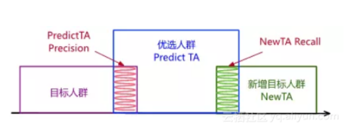
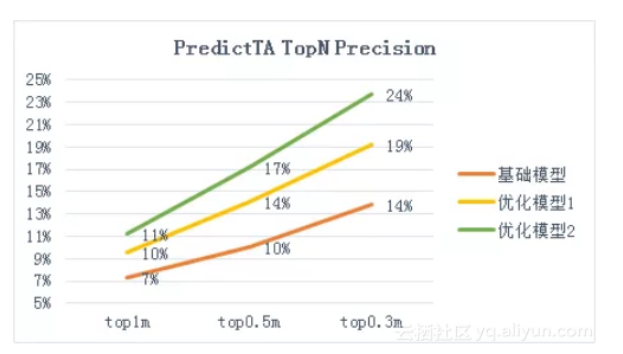

[TOC]

# Lookalike

Lookalike的目的是基于目标人群，从海量的人群中找出和目标人群相似的其他人群，这也是受众定向技术之一。

## 1. 业界方案

### 1.1 显性定位

#### 1.1.1 标签扩散

- 思想

标签本质是利用用户画像/标签体系，基于种子用户的标签，利用相同标签的方式找目标人群。这是最简单、高效、粗暴的一种方式。这种适合收集有大量用户数据能构建完整用户画像的公司做。

- 应用案例

腾讯DMP在用这种，首先是种子用户的获取，不再局限于需要自己去收集号码包自己上传，我们还可以按照你近期账户中的系统自动记录的种子用户的数据，系统会根据种子用户的标签与腾讯用户标签做匹配，会从上百万个维度对种子人群进行分析，从中筛选出最具代表性的**共有特征**。**根据这些特征再从全量活跃用户中筛选出另**一批与种子人群最相似的用户。

- 缺点

但这种方式所错成本高，手动调优难，投放效率低，所以往智能定向的方向发展，如协同过滤，序列推荐，图神经网络等，但很多平台仍然会提供这种传统的显示定向方式的。

### 1.2 隐性定位

参考《[A Sub-linear, Massive-scale Look-alike Audience Extension System](http://proceedings.mlr.press/v53/ma16.pdf)》里面的分类规则做如下划分

#### 1.2.1 基于相似度模型

- 思想

主要是基于User-User之间的某种距离大小来衡量用户之间的相似度，主流的相似度计算方法包括：针对连续值的余弦相似度(Cosine similarity)以及针对离散值的(Jaccard similarity)，除此之外还有皮尔森相关系数（Pearson Correlation Coefficient）、Jaccard相似系数（Jaccard Coefficient）、Tanimoto系数（广义Jaccard相似系数）

- 计算相似度

计算完个体之间的距离后，如何计算个体和样本整体之间的距离有三种方法：

1. 最大值Max：利用u1与seeds中相似度最大值作为u1与seeds的相似度 sim(u1,seeds)=Max(sim(uj,seeds))

2. 平均值Mean：利用u1与seeds中每个用户的相似度去均值作为整体相似度 sim(u1,seeds)=Mean(sim(uj,seeds))

3. 基于概率：该方法要求用户之间的相似度在[0,1]之间。通过不相似度反向得到相似度。

- 优缺点

这方法计算简单，适用于小范围的计算，因为每个用户都去计算和种子用户的距离，数据量大的时候，计算量呈现指数级上升，通常会采用LSH（Locality Sensitive Hashing ，局部敏喊哈希）的方式去加速计算，如领英的《[Audience Expansion for Online Social Network Advertising](https://www.kdd.org/kdd2016/papers/files/adf0483-liuA.pdf)》。

#### 1.2.2 基于标签的协同过滤

在标签扩散的基础上，采用基于用户的协同过滤算法，找到与种子人群相似的机会人群。协同过滤推荐算法分为两类：基于用户的协同过滤推荐算法和基于项目的协同过滤推荐算法。

- 基于用户的协同过滤推荐算法根据用户对项目的评分矩阵，计算用户之间的相似度，找出目标用户的最邻近邻居集合，最后，对最近邻居集合进行加权，从而产生目标用户的推荐集。
- 基于项目的协同过滤推荐算法根据对用户已评分项目相似项目的评分进行预测，从某种程度上减少了评分矩阵稀疏性和冷启动问题对推荐质量的影响。

这里采用的第一种算法，基于用户的协同过滤推荐算法的核心想法是通过寻找相似的用户，然后根据相似用户的关系进行推荐。例如，用户A喜欢电影a和c，用户B喜欢电影b，用户C喜欢电影a、c和d，通过数据可以发现用户A和用户C是是比较接近的人群，就是喜欢相同的，同时c还喜欢d，那么我们可以A也喜欢d电影，向A推荐d电影。如果将用户和电影（这里指特征）看做一个点建立起了联系，关系网就形成一张图。

- 第一阶段是从种子用户找到与用户相似的用户集，基于相似度去计算（有些会从种子用户计算推荐集）
- 第二阶段根据候选集产生推荐集，先得到最后推荐集，再通过Top-N排序算法得到用户

#### 1.2.3 基于社交关系的扩散

以具有相似社交关系的人也有相似的兴趣爱好/价值观为前提假设，利用社交网络关系进行人群扩散。

#### 1.2.4 基于聚类的扩散

根据用户标签，采用层次聚类算法（如BIRCH或CURE算法）对人群进行聚类，再从中找出与种子人群相似的机会人群，再通过Top-N排序算法得到用户。

#### 1.2.5 目标人群分类方法

将种子用户作为正例，将随机用户进行降采样后作为负例，为每个种子训练一个LR模型。用这个模型在全部用户上预测，后去判断其他的用户是否为目标人群

#### 1.2.6 基于图模型

基于图模型的代表就是Yahoo提出《[A Sub-linear, Massive-scale Look-alike Audience Extension System](http://proceedings.mlr.press/v53/ma16.pdf)》，文章在Abstract就直接写是基于图模型，由于选择特征的时候可以用LR，所以有些文章会将其划分到基于回归模型。

图模型可以分为两个阶段：

- 粗排序（Global Graph Construction）：通过构造全局图找相似的用户，而构造全局图使用的是Jaccard similarity，会带来计算量的问题，所以利用LSH（Locality Sensitive Hashing ，局部敏喊哈希）来加速相似度的计算并构造全局图，有两种计算方法方法MiniHash+LSH。
- 精排序（Campaign Specific Modeling）：根据广告特征权重对粗排序做排序，而对特征的选择可以选择IV（information value）或LR（logistic regression）方法。

#### 1.2.7 基于Attention深度模型

RALM算法：全名《[Real-time Attention based Look-alike Model](https://arxiv.org/pdf/1906.05022.pdf)》，这是腾讯最近提出的一个基于深度学习的Look-alike系统，已经微信上的看一看应用。它通过 user representation learning 表达用户的兴趣状态，通过 Look-alike learning 学习种子用户群体信息以及目标用户与种子用户群的相似性，从而实现实时且高效的受众用户扩展和内容触达。

### 1.3 一些论文/方案

- 基于图模型
  - Yahoo：《[A Sub-linear, Massive-scale Look-alike Audience Extension System](http://proceedings.mlr.press/v53/ma16.pdf)》

- 基于相似度模型
  - LinkedIn：《[Audience Expansion for Online Social Network Advertising](https://www.kdd.org/kdd2016/papers/files/adf0483-liuA.pdf)》
- 基于分类模型
  - 阿里：《[人群优选算法模型，如何挖掘品牌潜客？](https://mp.weixin.qq.com/s/OF51cPHD7C3rfw-WW5NA3Q)》
- 基于Attention深度模型
  - 腾讯：《[Real-time Attention based Look-alike Model](https://arxiv.org/pdf/1906.05022.pdf)》

## 2. 阅读笔记

### 2.1 阿里：[人群优选算法模型，如何挖掘品牌潜客？](https://developer.aliyun.com/article/649915)

#### 2.1.1 方案背景

策略中心年货节投放海豹项目，通过大数据+算法的手段，对A品牌的目标人群进行分析，建立人群优选算法模型，挖掘品牌目标潜客。品牌A的年货节实际投放效果，算法优选人群相比基于业务经验使用规则圈选的人群，在“O->IPL”人群关系加深率指标上好47%，显示了人群优选算法的有效性。

基于策略中心的品牌人群定向，与程序化广告的不同之处在于，要根据品牌方的营销需求（包括目标、渠道、时间和预算）产出特定规模的目标人群，进而再针对性地营销投放。

此次实践即以年货节拉新为目标，找到指定规模的潜在机会人群或者认知人群，通过营销投放将其转化为品牌兴趣人群和已购人群，从而提升品牌消费者资产。

方案选择：**多方向人群扩散+人群分类优选**

#### 2.1.2 技术方案框架

#### 2.1.3 多方向人群扩散

在人群扩散方向上，我们探索了6类方向，并在每个方向下挖掘有效特征，通过白盒条件筛选和黑盒模型预测的方式进行人群扩散。

##### 2.1.3.1 兴趣偏好方向

采用特征值TGI和TA浓度2个指标，挖掘了4个特征中与品牌相关的特征值，并根据特征值的全网覆盖量设定TGI和TA浓度阈值，进行白盒扩散。TGI指标衡量了特征值在品牌人群中的显著性，TA浓度则衡量了特征值在品牌人群中的覆盖率，因此二者共同考虑才能筛选出有效的人群扩散特征值。

##### 2.1.3.2 相关品类方向

1. 主营类目分析：根据品牌在线商品数和销售额计算筛选主营类目，并得出主营类目权重。

2. 相关品牌分析：根据brand-user关系矩阵，采用Jaccard相似度计算相关品牌及相关分。相似度计算公式如下：$sim(b_1, b_2)=U_{b_1} \and U_{b_2} / U_{b_1} \or U_{b_2}$

3. 相关类目分析：根据线上user-cate购买行为，通过Association Rule Mining挖掘相关类目，使用confidence指标筛选类目并作为相关分，然后经过类目关系的二度扩散得到最终相关类目结果。类目扩散公式如下，其中表示类目k：$sim(c_1, c_2)=\sum_k sim(c_1, c_k) * sim(c_k, c_2)$

##### 2.1.3.3 竞品人群方向

1. 竞品分析：当前品牌主营类目中，市场份额top10的其他品牌。

2. 人群流转分析：分析发现品牌新增人群中，有较大比例来自竞品，说明选择该方向进行扩散是可靠的。

3. 竞品人群转化模型：以来自竞品的人群为目标，挖掘用户在竞品的AIPL状态、退款、退货、评分、评价等特征，训练竞品人群转化模型。通过模型对竞品人群进行转换预测，实现人群扩散。

##### 2.1.3.4 搜索人群方向

1. 搜索关键词：从引导到品牌成交的搜索词中，综合考虑搜索词是否充分竞争以及本品牌在搜索词上是否有优势，实现品牌拉相关的搜索词发现。公式如下，其中E表示关键词引导成交的类目信息熵，$V_{kword}$表示关键词引导成交额，$V_{kword-brand}$表示关键词引导到品牌的成交额：

$kwords=argtop(E_{kword} * V_{kword-brand} / V_{kword})$

2. 搜索人群扩散：近15天内搜索了kwords并点击了品牌主营类目的用户。

##### 2.1.3.5 流失人群方向

对于之前属于品牌人群而现已流失了的用户，也进行扩散召回，包括近半年从IPL状态流失的用户和近1个月从A状态流失的用户。

##### 2.1.3.6  同好人群方向

基于用户的向量表示，可以直接计算用户与用户直接的相似度，从而得到种子用户最相似的topN个用户。用户表示的方法有多种，例如：

1. 用户偏好的类目向量、品牌向量组合。

2. 将user-item表示为二部图，基于graph embedding方法生成用户向量。

##### 2.1.3.7 人群扩散汇总

最终6个方向的品牌扩散人群汇总去重，作为人群优选模型的输入。

#### 2.1.4 目标人群优选模型

##### 2.1.4.1 设计评估指标

- 正负样本划分

训练集的正负样本，分别从品牌已购人群和其他品牌的人群中采样得到。从中训练的分类模型，可以较好的区分品牌目标人群和全网其它人群（大都和目标人群相距较远），但对区分和品牌目标人群相距不远的扩散人群则并非同样有效。

直接使用传统的分类指标，只能评估模型在训练集上的效果，不能准确评估其在扩散人群上的分类效果，需要设计新的评估指标。

- 指标设计

1. **PredictTA TopNPrecision**指标由此而来，表示优选的TopN人群中品牌目标人群的占比，该指标越大说明模型预测效果越好。我们通过对比该指标在不同模型上使用不同topN值的值，验证了它的一致性。
2. **NewTA topN Recall**指标，即优选人群在之后一段时间品牌新增目标人群的占比，验证了它的正确性。

上图中，紫色框表示品牌目标人群即种子人群，蓝色框表示模型优选出的TopN人群，它与种子人群有小部分交集，交集占蓝色框的比例即为PredictTATopN Precision。绿色框表示一周内品牌实际新增人群，与蓝色框的交集为预测准确的人群，交集占绿色框的比例即为NewTA topN Recall。

对于有效的算法模型，PredictTATopN Precision指标随着TopN的减小而增大。两个不同的算法模型，PredictTA TopN Precision指标在不同TopN取值上的表现是一致的，说明该指标的稳定性。以A品牌为例，其一致性验证结果如下图所示：

##### 2.1.4.2 模型训练

以品牌目标人群为正样本，从全网其它品牌的人群中随机选负样本，经过数据预处理、归一化、序列化编码后，训练并优化人群优选模型。

- 样本选择

1. 正样本选择

对于线上市场份额大的品牌而言，直接用品牌已购人群即可。但对新品牌或者线上市场份额小的品牌，已购人群可能很小，这时就需要对正样本进行扩充，比如加入兴趣人群、加入与品牌定位相似的其它品牌的人群。

2. 负样本选择

默认从全网其它品牌的人群中随机采样，但发现全网人群中特征缺失的情况比较多，负样本集离扩散人群比较远，因此实验了从全网其它品牌的已购人群中采样，PredictTA TopN Precision（N=300万）指标绝对值有0.8%的提升。

- 特征工程

1. 数值型特征离散化：年购物天数、近30天订单数等特征进行等距离散，提高模型稳定性和效果。

2. 枚举型特征值筛选：汽车型号、收货省份等特征长尾分布非常明显，筛选出与目标品牌相关的特征值。

3. 多值特征处理：偏好品牌、偏好类目这样的特征，一个用户可以同时有多个特征值。以品牌A品牌为例，我们在第二步筛选的基础上，对比了只保留偏好值最大的特征、只保留品牌最相关的特征、保留品牌相关的多个特征3种不同的处理方法，效果如下：

4. 特征编码。主要采用one-hot编码方式。

5. 稀疏特征embedding。对于类目id，品牌id这种高维高稀疏性的特征，直接将其作为分类模型的特征会影响最终的模型效果，为此，我们借鉴word embedding的思路，将用户过去一段时间内对类目（或品牌）的行为序列作为doc，将类目（或品牌）本身作为word，基于全网活跃用户的行为序列（doc集合）训练类目（或品牌）的embedding表示。具体而言，我们将类目（或品牌）编码为100维的低维稠密向量，并将其作为预测特征用于模型训练。

6. 特征选择。首先使用全部特征进行模型训练，然后根据特征重要性程度筛除部分尾部特征，重新训练模型，通过比较模型的PredictTA TopN Precision指标确定此次特征选择是否更好。

- 训练模型

1. LR模型：使用逻辑回归作为baseline的算法，除了模型简单容易理解外，还有个好处是可以得出特征和特征值的重要性。

2. RF模型：对随机森林模型的实验效果并不理想，在相同的样本和特征上Precision和AUC指标均比LR低，且特征重要性结果只能到特征粒度不能到特征值粒度，因此不再使用。

3. PS-SMART：基于PS架构的GBDT算法模型，决策树弱分类器加上GBM算法，具有较强的非线性拟合能力，在应用中相比其它两种算法模型效果更好。因此选择PS-SMART作为最终的算法模型，并对损失函数、树的个数深度、正则系数进行调优。

##### 2.1.4.3 模型预测

使用训练好的人群优选模型，对5.1节中产出的扩散人群进行预测打分，筛除预测分数小于0.5的人群，再根据拉新的目标过滤品牌现有IPL人群。

### 2.2 Yahoo：[A Sub-linear, Massive-scale Look-alike Audience Extension System](http://proceedings.mlr.press/v53/ma16.pdf)

